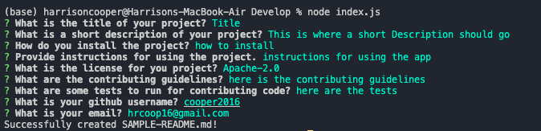

# README Generator 

## Description
In this project we wanted to create a README Generator. The generator will ask the user for all information related to their project and create a formatted README in the folder. This done using Node.js and everything is ran in a terminal. It also includes a section for a table of contents and how someone should contact you if there are additional questions about the project.

## Screenshot
This is what the prompts will look like when you successfully complete the application. 

